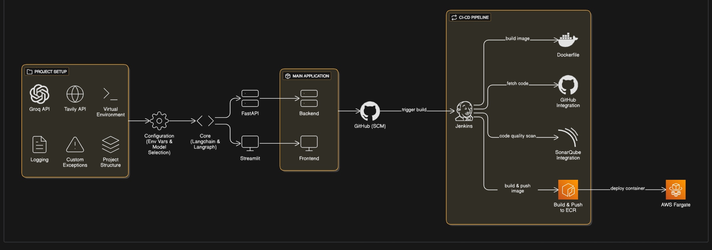

# Multi-Agent LLMOps

A production-ready multi-agent AI system powered by **Groq LLM** and **LangGraph**, with a complete **LLMOps pipeline** — from local development to automated deployment on **AWS ECS Fargate** via Jenkins CI/CD.

---

## Architecture



**Application layer** (single Docker container, two services):

| Component | Role |
|---|---|
| Streamlit UI (`:8501`) | Collects system prompt, model choice, query, web-search toggle |
| FastAPI (`:9999`, internal) | Validates the request and dispatches to the agent |
| LangGraph ReAct agent | Orchestrates LLM + optional Tavily search tool |
| Groq LLM | Generates the response |

The Streamlit container talks to FastAPI on `127.0.0.1:9999` inside the container; only `8501` is exposed externally.

**CI/CD pipeline**:

```
git push  →  Jenkins (Docker-in-Docker, WSL)
              │
              ├─ SonarQube scan  (container on dind-network)
              ├─ docker build + push to AWS ECR
              └─ aws ecs update-service --force-new-deployment
                       │
                       ▼
              AWS ECS Fargate (eu-north-1)  →  public IP:8501
```

---

## Tech Stack

| Layer | Technology |
|---|---|
| LLM | Groq (`llama-3.3-70b-versatile`) |
| Agent framework | LangGraph (ReAct), LangChain |
| Web search tool | Tavily |
| Backend API | FastAPI + Uvicorn |
| Frontend UI | Streamlit |
| Containerization | Docker |
| CI/CD | Jenkins (Docker-in-Docker) |
| Code quality | SonarQube |
| Container registry | AWS ECR |
| Cloud runtime | AWS ECS Fargate |

---

## Repository Layout

```
.
├── app/
│   ├── main.py                  # Entry point — spawns backend + frontend
│   ├── backend/api.py           # FastAPI POST /chat endpoint
│   ├── core/ai_agent.py         # LangGraph ReAct agent
│   ├── frontend/ui.py           # Streamlit UI
│   ├── config/settings.py       # Env vars + allowed model whitelist
│   └── common/                  # Logger, custom exception
├── custom_jenkins/Dockerfile    # Jenkins LTS + Docker CLI for DinD
├── assets/workflow.png          # Architecture diagram
├── Dockerfile                   # App image (python:3.10-slim)
├── Jenkinsfile                  # 4-stage CI/CD pipeline
├── requirements.txt
├── setup.py
├── .dockerignore
└── .gitignore
```

---

## Quick Start — Local Development

### Prerequisites
- Python 3.10+
- Docker Desktop (for the containerized path)
- A [Groq API key](https://console.groq.com)
- A [Tavily API key](https://tavily.com) (only needed if you want the web-search tool)

### Option A — Native Python

```bash
git clone https://github.com/uddipan77/multi-agent-llmops.git
cd multi-agent-llmops

python -m venv venv
# Windows
venv\Scripts\activate
# Linux/Mac
source venv/bin/activate

pip install -e .
```

Create a `.env` file at the project root (this file is gitignored — never commit it):

```
GROQ_API_KEY=your_groq_api_key_here
TAVILY_API_KEY=your_tavily_api_key_here
```

Run:

```bash
python app/main.py
```

Open `http://localhost:8501`.

### Option B — Docker

```bash
docker build -t multi-agent-llmops .
docker run -d --name multi-agent \
  --env-file .env \
  -p 8501:8501 \
  multi-agent-llmops
```

`docker logs -f multi-agent` to tail logs. Open `http://localhost:8501`.

### Using the app

1. **Define your AI Agent** — system prompt (e.g. *"You are a concise research assistant"*).
2. **Select model** — `llama-3.3-70b-versatile`.
3. **Allow web search** — tick to enable Tavily.
4. **Enter query** → **Ask Agent**.

---

## Production Deployment

The full pipeline pushes a Docker image to AWS ECR and force-deploys it to AWS ECS Fargate. All AWS resources live in `eu-north-1` (Stockholm).

### 1. AWS prep

#### IAM user (one-time)

In AWS Console → IAM → Users → Add user (e.g. `jenkins-deployer`). Attach managed policies:
- `AmazonEC2ContainerRegistryFullAccess`
- `AmazonECS_FullAccess`

Create an access key for "Application running outside AWS". Save the **Access Key ID** + **Secret Access Key** — they go into Jenkins, not into any file.

#### ECR repository (one-time)

ECR → Create repository:
- Visibility: Private
- Name: `multi-agent-llmops`
- Region: `eu-north-1`

Note the URI — `<account-id>.dkr.ecr.eu-north-1.amazonaws.com/multi-agent-llmops`.

#### ECS service-linked role (one-time, may already exist)

Some accounts need this created manually before ECS works. In AWS CloudShell:
```bash
aws iam create-service-linked-role --aws-service-name ecs.amazonaws.com
```
"Role already taken" means it exists — that's fine.

#### ECS cluster, task definition, service

ECS → Clusters → **Create cluster**:
- Name: `multi-agent-cluster`
- Infrastructure: AWS Fargate (serverless) only

ECS → Task definitions → **Create new task definition**:
- Family: `multi-agent-task`
- Launch type: AWS Fargate
- CPU: 0.5 vCPU, Memory: 1 GB
- Task role: leave empty
- Task execution role: `ecsTaskExecutionRole` (auto-created on first use)
- Container:
  - Name: `multi-agent`
  - Image URI: `<account-id>.dkr.ecr.eu-north-1.amazonaws.com/multi-agent-llmops:latest`
  - Port mappings: `8501/TCP`
  - Environment variables:
    - `GROQ_API_KEY` = your Groq key
    - `TAVILY_API_KEY` = your Tavily key

In your cluster → Services → **Create**:
- Compute: Launch type `FARGATE`, Platform version `LATEST`
- Application type: Service
- Task definition: `multi-agent-task`
- Service name: `multi-agent-service`
- Desired tasks: 1
- Networking: default VPC, default subnets, **Public IP: ON**

#### Security group inbound rule

EC2 → Security Groups → the SG attached to your service → **Edit inbound rules** → **Add rule**:
- Type: Custom TCP
- Port: `8501`
- Source: Anywhere-IPv4 (`0.0.0.0/0`)

Don't modify any existing self-referencing rules — add a new one.

### 2. Jenkins setup (Docker-in-Docker on WSL)

Jenkins runs as a privileged Docker container that talks to the host's Docker daemon via the mounted socket. Run from a WSL Ubuntu terminal (with Docker Desktop's WSL integration enabled, or Docker Engine installed natively in WSL):

```bash
cd custom_jenkins
docker build -t jenkins-dind .

DOCKER_GID=$(stat -c '%g' /var/run/docker.sock)
docker run -d --name jenkins-dind \
  --restart unless-stopped \
  --privileged \
  --group-add "$DOCKER_GID" \
  -p 8080:8080 -p 50000:50000 \
  -v /var/run/docker.sock:/var/run/docker.sock \
  -v jenkins_home:/var/jenkins_home \
  jenkins-dind
```

The `--group-add "$DOCKER_GID"` line grants the in-container `jenkins` user access to the host docker socket so the pipeline can `docker build`.

Get the initial admin password and install Python + AWS CLI inside the container:

```bash
docker exec jenkins-dind cat /var/jenkins_home/secrets/initialAdminPassword

docker exec -u root jenkins-dind bash -c '
apt-get update -y &&
apt-get install -y --no-install-recommends python3 python3-pip unzip curl &&
ln -sf /usr/bin/python3 /usr/bin/python &&
curl -sSL "https://awscli.amazonaws.com/awscli-exe-linux-x86_64.zip" -o /tmp/awscliv2.zip &&
cd /tmp && unzip -oq awscliv2.zip &&
(./aws/install || ./aws/install --update) &&
aws --version
'
docker restart jenkins-dind
```

Open `http://localhost:8080` → paste the admin password → install suggested plugins → create admin user.

### 3. Jenkins plugins

**Manage Jenkins → Plugins → Available** → search and install:
- **SonarQube Scanner** — runs `sonar-scanner` from the pipeline
- **Sonar Quality Gates** — surfaces SonarQube quality-gate result in Jenkins
- **AWS Credentials** — adds the "AWS Credentials" credential type
- **Pipeline: AWS Steps** — provides `withAWS`, `awsIdentity` etc. (not strictly required by this Jenkinsfile but standard)

Tick "Restart Jenkins when installation is complete and no jobs are running". The first restart often exits the container (no restart policy) — bring it back with `docker start jenkins-dind`. The `--restart unless-stopped` flag we added prevents this on subsequent restarts.

### 4. Jenkins credentials

**Manage Jenkins → Credentials → System → Global** → **+ Add Credentials** (three times). The `Jenkinsfile` references each by exact ID:

| ID | Kind | Value |
|---|---|---|
| `github-token` | Username with password | username = your GitHub username; password = a GitHub PAT with `repo` scope |
| `aws-token` | AWS Credentials | the IAM access key ID + secret from "AWS prep" |
| `sonarqube-token` | Secret text | global analysis token from SonarQube (see next section) |

### 5. SonarQube setup

SonarQube refuses to start unless `vm.max_map_count >= 524288`. Set it via a privileged throwaway container, then run SonarQube on a shared docker network so Jenkins can reach it by container name:

```bash
docker run --rm --privileged alpine sh -c "
sysctl -w vm.max_map_count=524288
sysctl -w fs.file-max=131072
"

docker network create dind-network
docker network connect dind-network jenkins-dind

docker run -d --name sonarqube-dind \
  --restart unless-stopped \
  --network dind-network \
  -p 9000:9000 \
  sonarqube:lts-community
```

Wait ~2–3 min, then open `http://localhost:9000`:
1. Log in `admin` / `admin` → set a new password.
2. **Create a local project** → name + key = `LLMOPS` → main branch `main`.
3. Choose **Locally** → generate a token (e.g. `jenkins-token`) → copy it.

Add the token to Jenkins as the `sonarqube-token` credential (Secret text) from step 4.

**Manage Jenkins → System → SonarQube servers → Add SonarQube**:
- Name: `Sonarqube` (must match `withSonarQubeEnv('Sonarqube')` in the Jenkinsfile)
- URL: `http://sonarqube-dind:9000`
- Credentials: `sonarqube-token`

**Manage Jenkins → Tools → SonarQube Scanner installations → Add**:
- Name: `Sonarqube` (must match `tool 'Sonarqube'` in the Jenkinsfile)
- ☑ Install automatically (Maven Central, latest)

### 6. Pipeline job

Jenkins → **+ New Item** → name `multi-agent-pipeline` → **Pipeline** → OK.

Configuration:
- **Definition**: Pipeline script from SCM
- **SCM**: Git
- **Repository URL**: `https://github.com/<your-username>/multi-agent-llmops.git`
- **Credentials**: `github-token`
- **Branches to build**: `*/main`
- **Script Path**: `Jenkinsfile`

**Save** → **Build Now**.

---

## Pipeline behaviour

| Stage | What happens |
|---|---|
| Cloning Github repo | `git clone` of your repo with `github-token` |
| SonarQube Analysis | Downloads scanner (first run only), scans, posts to `http://sonarqube-dind:9000` |
| Build and Push Docker Image to ECR | `aws ecr get-login-password` → `docker build` → `docker push` to your ECR repo |
| Deploy to ECS Fargate | `aws ecs update-service --cluster multi-agent-cluster --service multi-agent-service --force-new-deployment` — pulls fresh image, replaces task |

After a successful run, get the **new public IP** of the task: ECS → cluster → Tasks tab → click the running task → Configuration → Public IP. Browse `http://<public-ip>:8501`.

> Each redeploy gives a new public IP because the service has no Application Load Balancer in front. Add an ALB if you need a stable address.

---

## Troubleshooting

**`langgraph` `state_modifier` error** — In `langgraph` ≥ 1.0 the parameter was renamed to `prompt`. This repo already uses `prompt`.

**`software-properties-common` not found when building `jenkins-dind`** — The base image switched to Debian trixie. The `custom_jenkins/Dockerfile` here auto-detects the codename and uses the modern keyring approach, so this won't bite you.

**Jenkins container exits after a plugin restart** — Run with `--restart unless-stopped` (shown above); or bring it back manually with `docker start jenkins-dind`. State is preserved in the `jenkins_home` volume.

**Permission denied on `/var/run/docker.sock` from Jenkins** — Pass `--group-add "$DOCKER_GID"` (using the host socket's GID) to `docker run`.

**ECS create cluster fails: "Unable to assume the service linked role"** — Run `aws iam create-service-linked-role --aws-service-name ecs.amazonaws.com` once in CloudShell, then retry.

**ECS create cluster fails: "A CloudFormation stack already exists for a failed cluster"** — A previous failed attempt left an orphan stack. Click "View in CloudFormation" → delete the stack → retry.

**Security group "You may not specify an IPv4 CIDR for an existing referenced group id rule"** — You're editing the wrong row. Don't modify the default self-referencing rule; click **+ Add rule** to create a new TCP/8501/0.0.0.0/0 rule alongside it.

**SonarQube container exits immediately** — Re-run the privileged `sysctl -w vm.max_map_count=524288` command, then restart the SonarQube container.

---

## Security notes

- `.env`, `.git/`, build artefacts, and Jenkins state are all gitignored or dockerignored — never bake secrets into images.
- ECS task definition env vars are the prod equivalent of `.env`. Update them via the AWS Console (creates a new task definition revision) and force a redeploy.
- IAM policies in this guide are intentionally broad (FullAccess) for simplicity. For production, scope them down to the specific ECR repo and ECS cluster ARNs.
- The default security group rule above (`0.0.0.0/0`) opens 8501 to the world. For non-demo deployments, restrict the source CIDR or front the service with an ALB + WAF.
